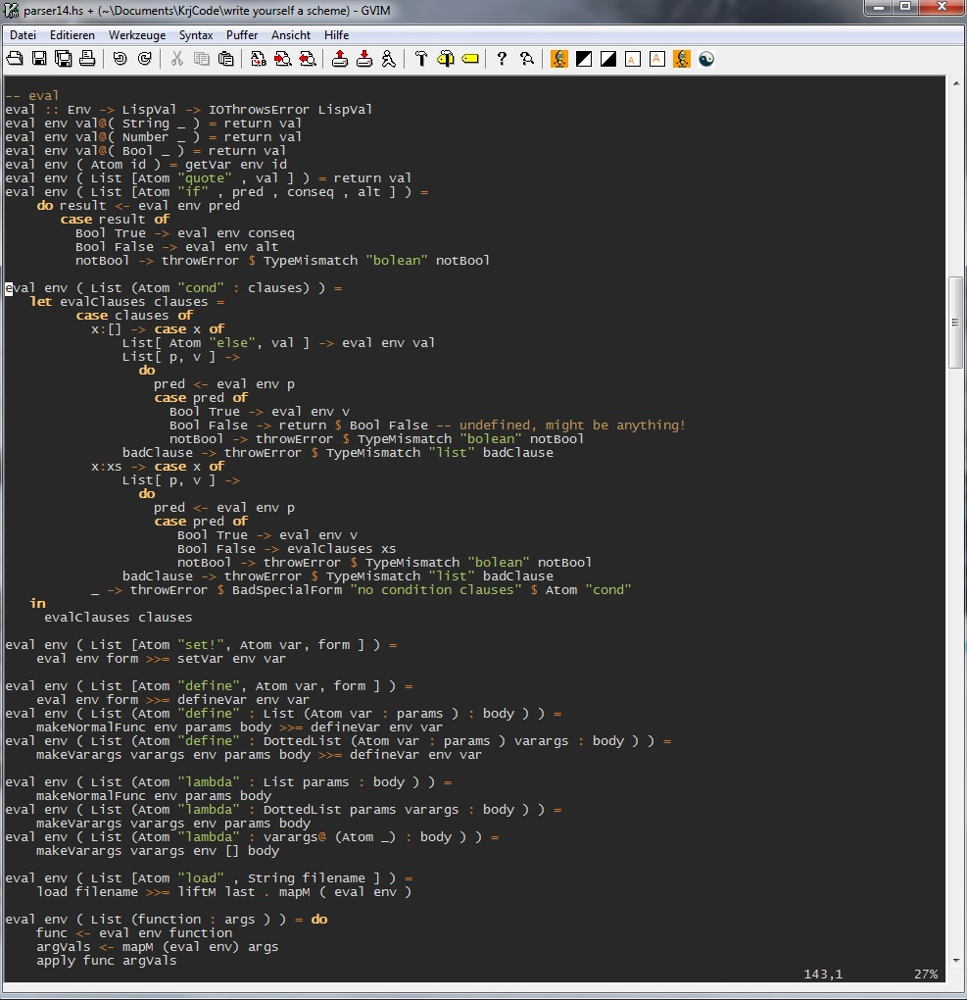

# write-yourself-a-scheme
A simple Scheme intepreter in Haskell - showing all steps from start to final version: 

Based on the *"Write Yourself a Scheme in 48 Hours - An Introduction to Haskell through Example"* [wikibook (PDF)](https://upload.wikimedia.org/wikipedia/commons/a/aa/Write_Yourself_a_Scheme_in_48_Hours.pdf) by Jonathan Tang et al. Read it to understand the code. The last version contains some extensions not discussed in the wikibook.

